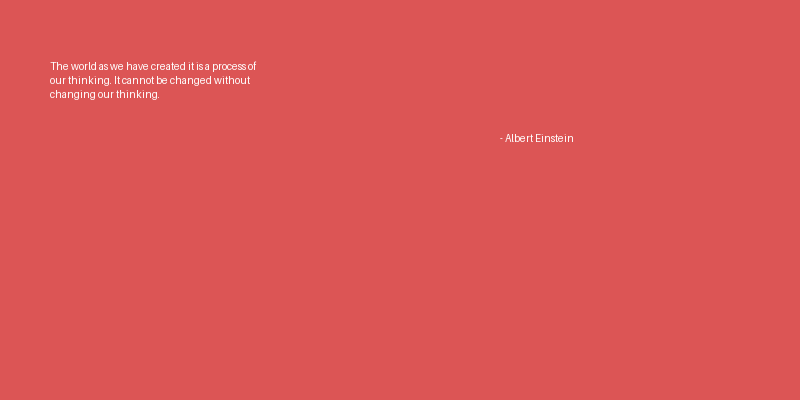

# Image Generating with Scraped Quotes

## Overview
This project scrapes quotes from [quotes.toscrape.com](https://quotes.toscrape.com/) and generates visually appealing images for the top 5 quotes using Python. The images are saved in the `quotes/` directory.

## Features
- Scrapes quotes and authors from a public website
- Generates PNG images with the quote and author
- Customizable image size, background, and text color
- Saves images in a dedicated folder

## Project Structure
```
├── main.py               # Main script to run the project
├── pyproject.toml        # Project dependencies and metadata
├── README.md             # Project documentation
├── uv.lock               # Lock file for dependencies
└── quotes/               # Output directory for generated images
    ├── quote_1.png
    ├── quote_2.png
    └── ...
```

## Requirements
- Python 3.13+
- See `pyproject.toml` for required packages:
  - requests
  - beautifulsoup4
  - lxml
  - pillow

## **Installation**
1. **Clone the repository:**
   ```powershell
   git clone https://github.com/kamatealif/webScoop/tree/main/image_generating_with_scraped_quotes

   cd image_generating_with_scraped_quotes
   ```
2. **Install dependencies:**
   ```powershell
   pip install -r requirements.txt
   # or, if using uv/pyproject.toml:
   uv pip install
   ```

## Usage
Run the main script:
```powershell
uv run .\main.py
```

- The script will fetch the top 5 quotes and generate images in the `quotes/` folder.
- Each image will contain the quote text and the author's name.

## How It Works
1. **Scraping:**
   - The script fetches the homepage of [quotes.toscrape.com](https://quotes.toscrape.com/).
   - It parses the HTML to extract the first 5 quotes and their authors.
2. **Image Generation:**
   - For each quote, an image is created with a colored background and white text.
   - The quote and author are rendered using the Pillow library.
   - Images are saved as `quote_1.png`, `quote_2.png`, etc.

## Customization
- You can change the number of quotes, image size, background color, or font by editing `main.py`.
- The output directory can be changed by modifying the `OUTPUT_DIR` variable.

## Example Output


## License
This project is for educational purposes.
